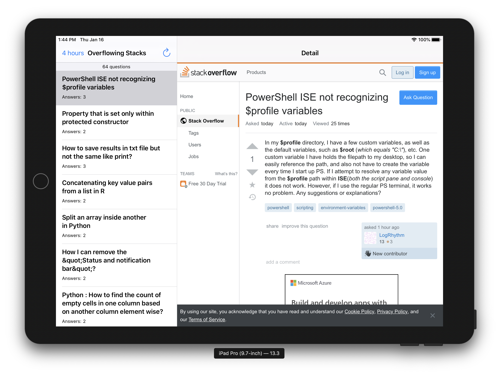

# Overflowing Stacks

This is an `iOS 13.2+` app that retrieves recently submitted questions from Stack Overflow that have an accepted answer and more than one answer. The past duration is set to 4 hours initially but can be changed by clicking on the top left navigation button.

`Update:` Added SwiftUI target in the same project.  

- Using TDD (brief) and MVVM pattern
- Generated the app using the iOS master-detail template so some boiler plate code may still be around
- The master view retrieves a page at a time (50 questions), filters them and displays the relavent ones.  
- Settings accessible by clicking on the duration display on the top left
- Retrieves and displays a small subset at a time directly from the service
- Clicking on the master row will display the detail question in a web view
- Core data used to save settings (duration) only
- Refresh stops the multi-page retrieves and starts another retrieve.
- Remaining quota shown on the SEttings page

## Building and Running

- Last built `XCode 11.3.1` and ran in the simulator successfully
- Clone the repository and checkout the `master` branch and you should be able to run it on any simulator in XCode.

### This is the Story Board version, will attempt the SwiftUI version later

## Screen Shots

The user inteface is intuitive, displays the recently submitted Stack Overflow questions. Works on both the iPad and iPhone correctly. Realize that on the iPad in portrait mode the master view is hidden by default and you need to swipe right from the left to show it. 

 

 
